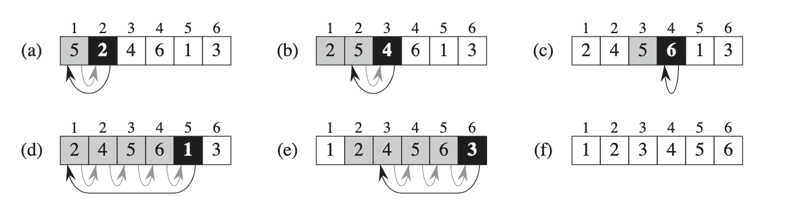
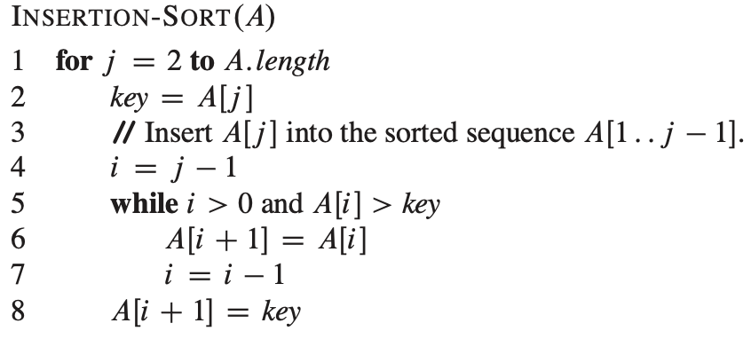

# Getting Started

## Insertion sort

It works the same way many people sort a hand of playing cards.

**Loop invariants and the correctness of insertion sort**

We use loop invariants to help us understand why an algorithm is correct. We must show three things about a loop invariant: 

**Initialization**: it is true prior to the first iteration of the loop.

**Maintenance**: if its is true before an iteration of the loop, it remains true before the next iteration. 

**Termination**: when the loop terminates, the invariant gives us a useful property that helps show that the algorithm is correct or not. 

In the case of insertion sort, the loop invariant is $A[1..j-1]$. 

