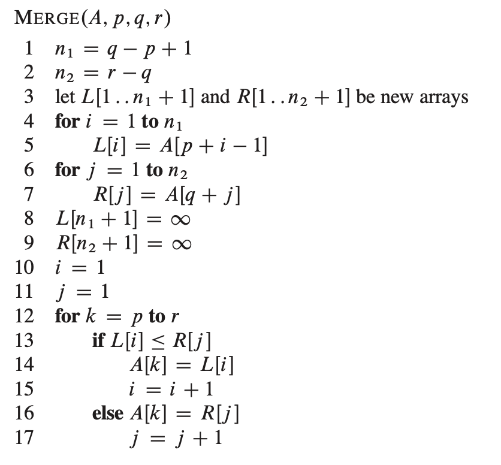
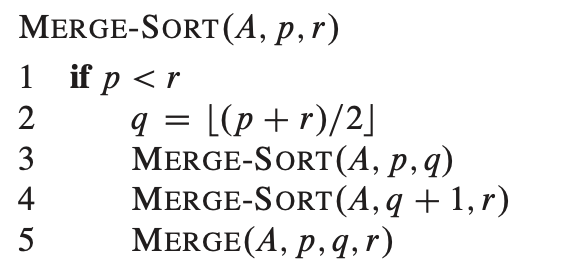

# Getting Started

## Insertion sort

It works the same way many people sort a hand of playing cards.

**Loop invariants and the correctness of insertion sort**

We use loop invariants to help us understand why an algorithm is correct. We must show three things about a loop invariant: 

**Initialization**: it is true prior to the first iteration of the loop.

**Maintenance**: if its is true before an iteration of the loop, it remains true before the next iteration. 

**Termination**: when the loop terminates, the invariant gives us a useful property that helps show that the algorithm is correct or not. 

In the case of insertion sort, the loop invariant is $A[1..j-1]$. 

## Analyzing algorithms

We shall asume a generic one-processor computer -> **RAM model**. In this model, instructions such as arithmetic (add, subtract, multiply, divide, remainder, floor, ceiling), data movement (load, store, copy) and control (conditional paths, subroutine calls and return) takes a constant amount of time. 

It is traditional to describe the *running time* of an algorithm as function of the *size of its input*. 

*input size*: the number of items in the input. 

*running time*: number of primitive operations or steps executed.

We are primarly concerned with the **worst-case running time** becuase: 

- Gives us an upper bound on the running time for any input, this means that the algorithm will never take any longer. 
- Occurs fairly often. For example, when searching for information that does not exist in a database. 

**Order of growth**

Simplification of the running time equation to consider only the leading term of it. $\theta(n^2)$ for Insertion sort. -> $\theta$ notation. 

## Designing algorithms

### Divide and conquer approach

**Divide** the problem into a number of subproblems that are smaller instances of the same problem. 

**Conquer** the subproblems by solving them recursively and if the subproblem is small enough, just solve the subproblems in a straightforward manner. 

**Combine** the solutions to the subproblems into the solution for the original problem. 

Example of divide and conquer: *merge sort*.

